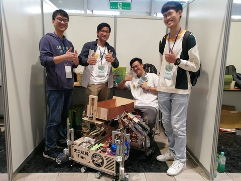

# 🏆 Awards & Honors

### 🤖 Competitions

  26th TDK Cup (2021): Excellent Work Award
  

    <strong>Category:</strong> Automatic Robotic Group  
    <strong>Organization:</strong> TDK Foundation & Ministry of Education
  

  

    <iframe 
      width="100%" 
      height="300" 
      src="https://www.youtube.com/embed/ZmdiB1q2GPI" 
      frameborder="0" 
      allowfullscreen>
    </iframe>
  

  24th TDK Cup (2019): Selection Award
  

    <strong>Category:</strong> Remote Control Robotic Group  
    <strong>Organization:</strong> TDK Foundation & Ministry of Education
  

  

    
  

---

### 💰 Scholarships & Grants

  

    2026
    Graduate Research Scholarship <small>(NYCU Robotics)</small>
  

  
  

    2025
    NSTC Graduate Student International Conference Travel Grant
  

  

    2024 & 2025
    Graduate Research Scholarship <small>(NYCU Robotics)</small>
  

  

    2023
    Master's Program Entrance Scholarship
  

