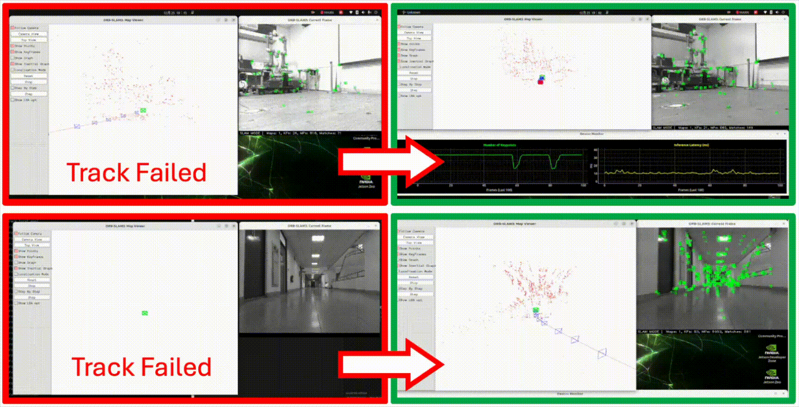
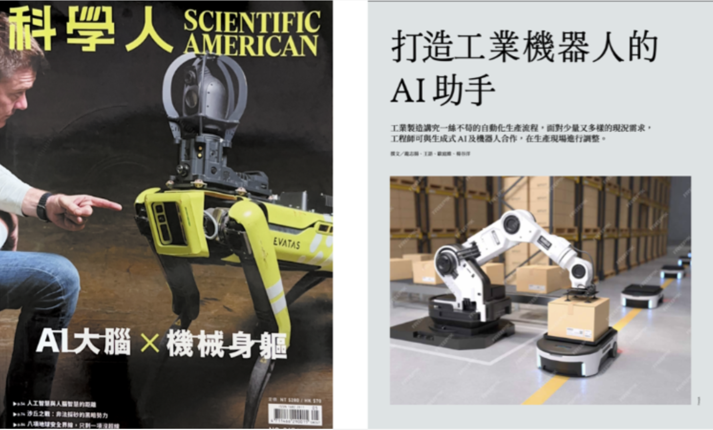
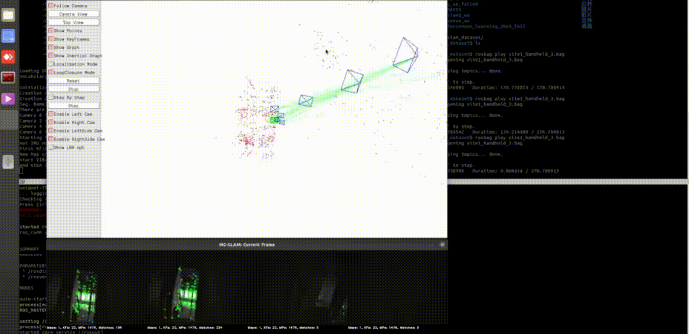
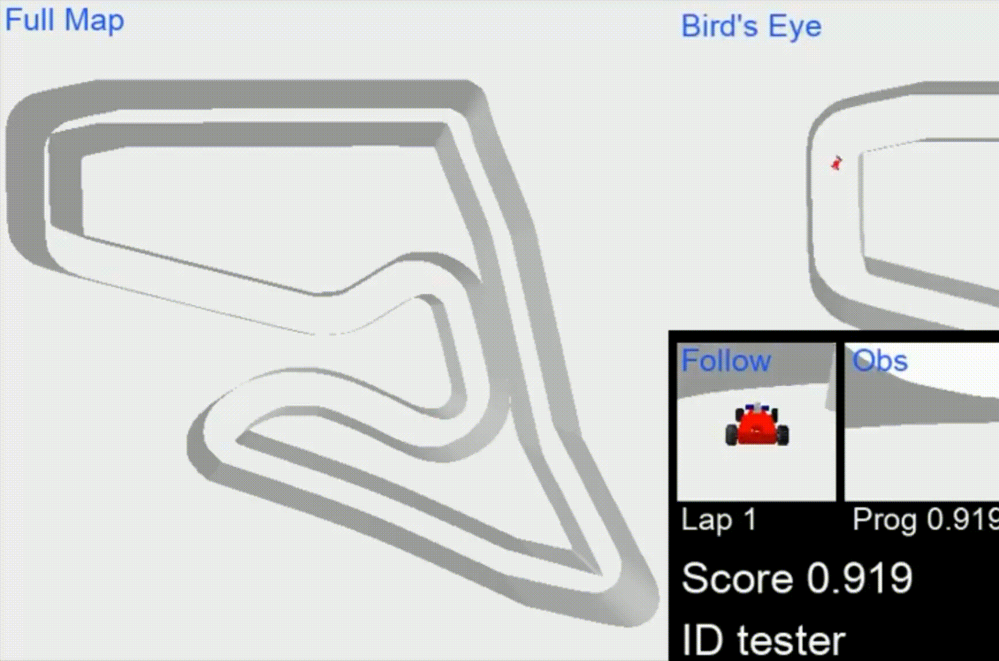
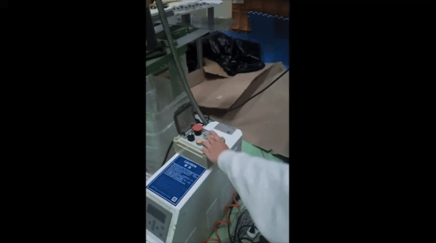
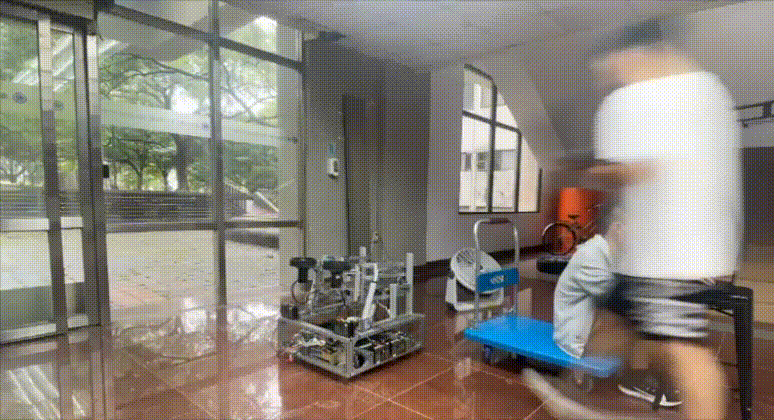

Hi! I'm Wade, a Master's student in Robotics at **[National Yang Ming Chiao Tung University (NYCU)](https://www.nycu.edu.tw/nycu/en/index)**, where I work under the supervision of **[Prof. Kuu-Young Young](https://robotics.nycu.edu.tw/tw/teachers/show.php?num=14&page=2)** in the Human and Machine Lab. I received my B.S. in Mechanical Engineering from NYCU.

My research sits at the intersection of **Computer Vision** and **Robotics**, with a particular focus on improving system robustness in challenging real-world environments. Beyond academia, I have a strong passion for building intelligent robotic systems and tackling industrial problems, drawing from my experience as Team Leader of the **[NYCU iTron Robotics Team](https://itrongoto.us/)** and as an Automatic System Development Engineer at **[Hong Lang Technology Co., Ltd](https://www.honglang-tw.com/?lang=en)**.

Education

  

    2023 - Pres.
    
      <strong>National Yang Ming Chiao Tung University (NYCU)</strong> 
      formerly National Chiao Tung University (NCTU) 
      Graduate Degree Program of Robotics
    
    
  

  

    2019 - 2023
    
      <strong>National Yang Ming Chiao Tung University (NYCU)</strong> 
      formerly National Chiao Tung University (NCTU) 
      Bachelor of Science in Mechanical Engineering
    
    
  

Publications

  

    <!-- 左邊縮圖 -->
    

      
    

  <!-- 右邊資訊 -->
  
    <strong style="font-size: 1em; color: #000;">
      Desc++: Efficient Context-Aware Feature Descriptor Enhancement for Data Association in Visual SLAM
    </strong> 

  
    Ting-Wei Ou, H.T. Lin, and Kuu-Young Young
  

  
    Comming Soon...
  

  <!-- 超連結按鈕 -->
  
    <a href="https://arxiv.org/abs/xxxx" target="_blank" class="btn-link">📄 arXiv</a>
    <a href="https://github.com/yourrepo" target="_blank" class="btn-link">💻 GitHub</a>
    <a href="https://yourdemo.com" target="_blank" class="btn-link">🌐 Demo</a>
    <a href="https://youtube.com/xxx" target="_blank" class="btn-link">🎬 Video</a>
  
  
  

<!-- SMC -->
  

    <!-- 左邊縮圖 -->
    

      
    

  <!-- 右邊資訊 -->
  
    <strong style="font-size: 1em; color: #000;">
      Development of an Autonomous Mobile Robotic System for Efficient and Percise Disinfection
    </strong> 

  
    Ting-Wei Ou, J.H. Jiang, G.L. Huang, and Kuu-Young Young
  

  
    IEEE International Conference on Systems, Man, and Cybernetics (SMC) | Oct 2025, Vienna, Austria.
  

  <!-- 超連結按鈕 -->
  
    <a href="https://arxiv.org/abs/2507.11270" target="_blank" class="btn-link">📄 arXiv</a>
    <a href="https://www.youtube.com/watch?v=wHcWzOcoMPM" target="_blank" class="btn-link">🎬 Video</a>
  
  
  

<!-- Scientific Amarican -->
  

    <!-- 左邊縮圖 -->
    

      
    

  <!-- 右邊資訊 -->
  
    <strong style="font-size: 1em; color: #000;">
      Create an AI assistant for Industrial Robots
    </strong> 

  
    J.Y Long, Yu Wang, Ting-Wei Ou, and Kuu-Young Young
  

  
    Scientific American 2024.05 (Taiwan Scientists Co., Ltd)
  

  <!-- 超連結按鈕 -->
  
    <a href="https://yourdemo.com" target="_blank" class="btn-link">🌐 Article</a>
  
  
  

<!-- Side Projects -->

🔧 Side Projects

  <!-- ORB+FeatureBooster -->
  

    <!-- 左邊縮圖 -->
    

      
    

  <!-- 右邊資訊 -->
  
    <strong style="font-size: 1em; color: #000;">
      ORB-SLAM + FeatureBooster
    </strong> 

  
    This project integrates ORB-SLAM2 with FeatureBooster to enhance feature matching ability. We also implemented model quantilization to reduce memory footprint for edge gpus.
  

  <!-- 超連結按鈕 -->
  
    <a href="https://github.com/ouotingwei/ORB-SLAM2-FeatureBooster" target="_blank" class="btn-link">💻 GitHub</a>
    <a href="https://www.youtube.com/watch?v=GHhYdiVRHz4" target="_blank" class="btn-link">🎬 YouTube</a>
  
  
  

  <!-- MAVIS -->
  

  <!-- 左邊縮圖 -->
  

    
  

  <!-- 右邊資訊 -->
  
    <strong style="font-size: 1em; color: #000;">
      Extended Multi-camera ORB-SLAM3
    </strong> 

  
    Implementation of MAVIS-SLAM with ROS integration, enhancing robustness in challenging scenarios such as camera occlusion and severe illumination changes.
  

  <!-- 超連結按鈕 -->
  
    <a href="https://github.com/ouotingwei/mavis_ros.git" target="_blank" class="btn-link">💻 GitHub</a>
    <a href="https://www.youtube.com/watch?v=Ie2tCVeXMDU" target="_blank" class="btn-link">🎬 YouTube</a>
    
  
  
  

  <!-- ppo -->
  

  <!-- 左邊縮圖 -->
  

    
  

  <!-- 右邊資訊 -->
  
    <strong style="font-size: 1em; color: #000;">
      Reinforcement Learning-baced FPV Racing Car
    </strong> 

  
    Implemented Proximal Policy Optimization(PPO) to learn an end-to-end control policy. The agent learns to naviate directly from raw image inputs.
  

  <!-- 超連結按鈕 -->
  
  
  
  

<!-- undergraduate project -->
  

  <!-- 左邊縮圖 -->
  

    
  

  <!-- 右邊資訊 -->
  
    <strong style="font-size: 1em; color: #000;">
      Visual SLAM in Dynamic Environments
    </strong> 

  
    I mentored an undergraduate students (2025) on a project to improve the robustness of Visual SLAM in dynamic scenes. We integrated YOLOv8 semantic segmentation into ORB-SLAM2 to detect and remove feature points on moving objects, particularly humans, thereby reducing their adverse impact on front-end camera pose estimation.
  

  <!-- 超連結按鈕 -->
  
  
  
  

<!-- HL Project -->
  

    <!-- 左邊縮圖 -->
    

      
    

  <!-- 右邊資訊 -->
  
    <strong style="font-size: 1em; color: #000;">
      Development of an Autonomous Plasma Spraying System
    </strong> 

  
    This project was developed during my time as a System Development Engineer at Hong Lang Technology Co., Ltd. The goal was to build an automated plasma-spraying system. The work involved surface reconstruction, robotic arm path planning, and user I/O interface and visualization.
  

  <!-- 超連結按鈕 -->
  
    <a href="https://www.youtube.com/watch?v=sccCDnw98aE" target="_blank" class="btn-link">🎬 YouTube</a>
  
  
  

<!-- iTron -->
  

    <!-- 左邊縮圖 -->
    

      
    

  <!-- 右邊資訊 -->
  
    <strong style="font-size: 1em; color: #000;">
      Development of a Mobile Robot Platform for TDK Robocon
    </strong> 

  
    During my time with the NYCU iTron Robotics Team, our group developed a robot capable of autonomous navigation, basketball shooting, and bowling. I was responsible for LiDAR Localization and chassis control.
  

  <!-- 超連結按鈕 -->
  
    <a href="https://github.com/ouotingwei/autonomous-basketball-and-bowling-vehicle.git" target="_blank" class="btn-link">💻 GitHub</a>
    <a href="https://www.youtube.com/watch?v=ZmdiB1q2GPI" target="_blank" class="btn-link">🎬 YouTube</a>
  
  
  

Industry Experience & Services

  

    2023 – 2024
    
      <strong>Hong Lang Technology Co., Ltd.</strong> 
      Automatic System Development Engineer 
      Developed automated machinery systems to modernize traditional footwear manufacturing processes for industrial-scale production.
    
  

  

    2020 – 2021
    
      <strong>NYCU iTron Robotic Team</strong> 
      Team Leader 
      Led the design, software-hardware integration, and competition deployment of customized robotic platforms.
    
  

Teaching Experience

  

    Spring 2025
    
      <strong>NYCU</strong> 
      Teaching Assistant, 535311: Robotics 
    
  

<!-- Honors and Scholarships -->

Honors and scholarships

  

    2026
    
      <strong>NYCU</strong> 
      Graduate Research Scholarship (NYCU Robotics) 
    
  

  

    2025
    
      <strong>NYCU</strong> 
      NSTC Graduate Student International Conference Travel Grant 
    
  

  

    2025
    
      <strong>NYCU</strong> 
      Graduate Research Scholarship (NYCU Robotics) 
    
  

  

    2024
    
      <strong>NYCU</strong> 
      Graduate Research Scholarship (NYCU Robotics) 
    
  

  

    2023
    
      <strong>NYCU</strong> 
      Master’s Program Entrance Scholarship (First place) 
    
  

  

    2021
    
      <strong>NYCU</strong> 
      26th TDK Robocon: Honorable Mention (Autonomous Robotics) 
    
  

