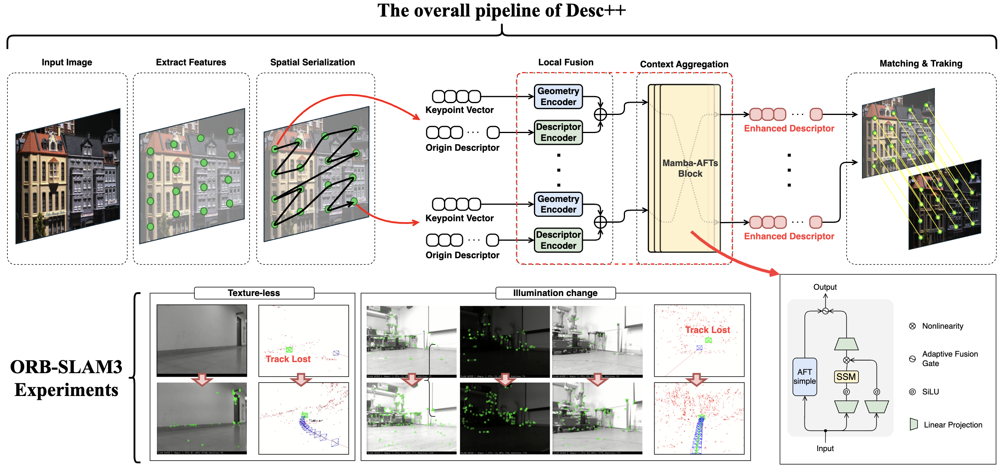
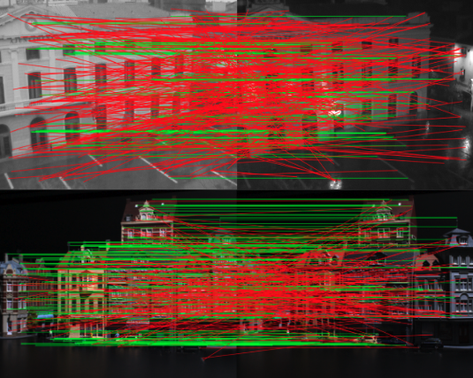
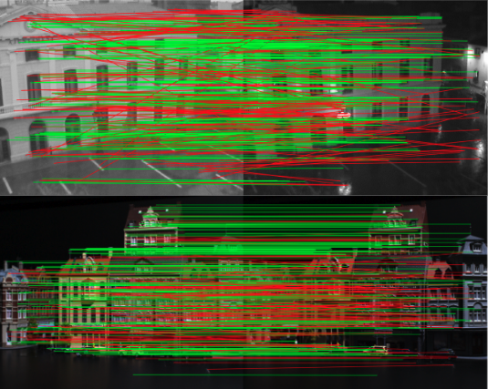
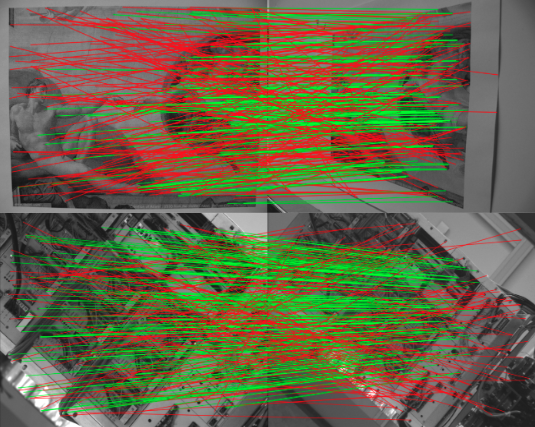
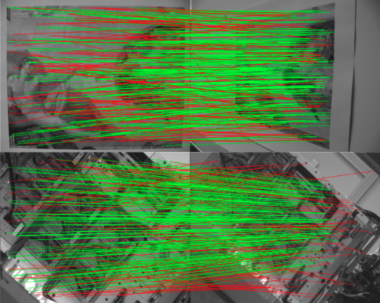
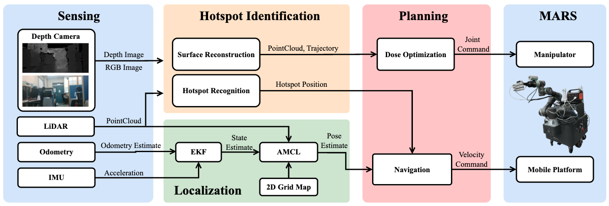

# 📄 Publications

  Desc++: Efficient Context-Aware Feature Descriptor Enhancement for Data Association in Visual SLAM
  
  

    <strong>Authors:</strong> Ting-Wei Ou, H.T. Lin, J.Y. Long, and Kuu-Young Young  
    <strong>Conference:</strong> Coming Soon...
  

  
Desc++

  

    
  

  
Desc++ Enhanced ORB Comparison

  

    

      

        
        

      

    

    

      

        
        

      

    

  

  

  <a href="https://arxiv.org/abs/你的ID" target="_blank" class="btn-link btn-arxiv">
    <i class="fas fa-file-alt"></i> arXiv
  </a>
  <a href="https://youtube.com/watch?v=你的影片" target="_blank" class="btn-link btn-youtube">
    <i class="fab fa-youtube"></i> YouTube
  </a>
  <a href="https://github.com/你的專案" target="_blank" class="btn-link btn-github">
    <i class="fab fa-github"></i> GitHub
  </a>
  

  Development of an Autonomous Mobile Robotic System for Efficient and Precise Disinfection
  
  

    <strong>Authors:</strong> Ting-Wei Ou, J.H. Jiang, G.L. Huang, Kuu-Young Young  
    <strong>Conference:</strong> IEEE International Conference on Systems, Man, and Cybernetics (SMC) | Oct 2025, Vienna, Austria.
  

  
System architecture of the mobile robotic UV disinfection system.

  

    
  

  
Demo Video
  

  

    <iframe width="100%" height="300" src="https://www.youtube.com/embed/wHcWzOcoMPM" frameborder="0" allowfullscreen></iframe>
  

  

  <a href="https://arxiv.org/abs/2507.11270" target="_blank" class="btn-link btn-arxiv">
    <i class="fas fa-file-alt"></i> arXiv
  </a>
  <a href="https://www.youtube.com/watch?v=wHcWzOcoMPM" target="_blank" class="btn-link btn-youtube">
    <i class="fab fa-youtube"></i> YouTube
  </a>
  

  Creating an AI Assistant for Industrial Robots
  
  

    <strong>Authors:</strong> Jhih-Yang Long, Yu Wang, Ting-Wei Ou, Kuu-Young Young
    <strong>Source:</strong> Scientific American 2024.05.01 (Taiwan Scientists Co., Ltd)  
  

  

  

  <a href="https://www.scitw.cc/posts/AI-Robit" target="_blank" class="btn-link btn-website">
    <i class="fas fa-globe"></i> Website
  </a>
  

